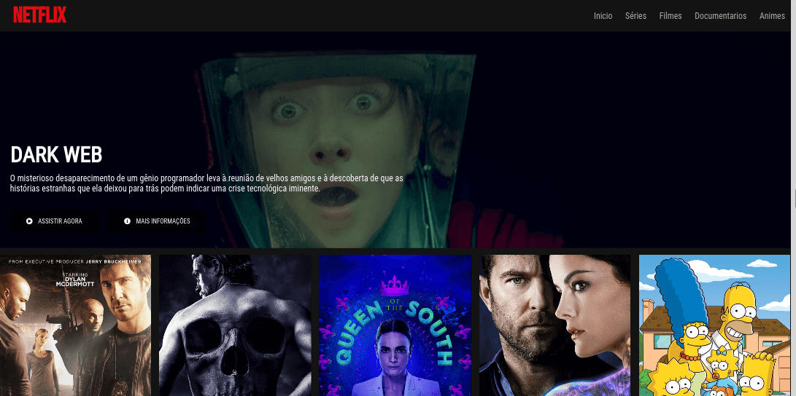
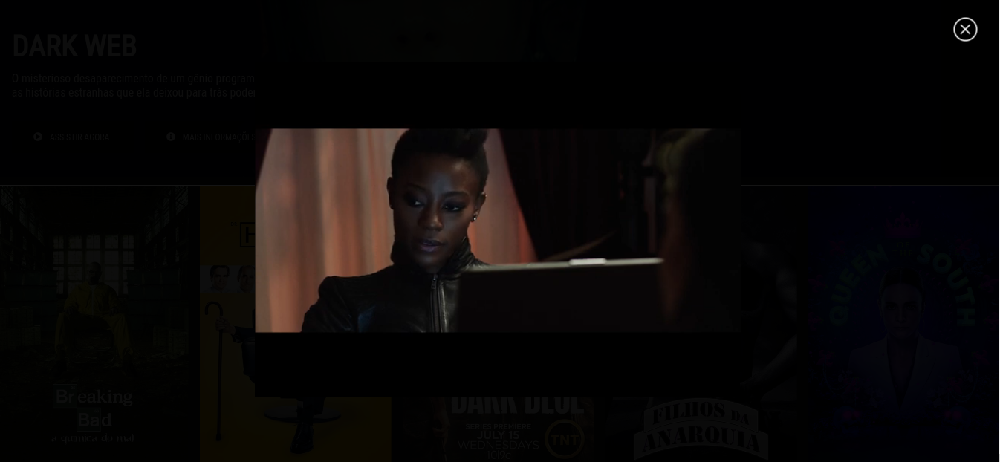

## 💻 Projeto recriando a interface do Netflix

Projeto desenvolvido no bootcamp da Everis da DIO com as tecnologias.

- HTML
- CSS
- JS
- Jquery

### Funções adicionais:

- Owl Carousel: Adicionado o autoplay para os slides, realizando transições a cada 3 segundos;
- Botão Assitir agora: Abre um modal que é possível executar o trailer da série direto do youtube;
- Botão Mais informações: Abre um modal com informações da série, e um link que redireciona para o site themoviedb.org;
- Fonts: Adicionado Roboto Condensed e Bebas Neue da google fonts;

  
  
  

### Repositório da aula:
https://github.com/felipeAguiarCode/netflix-clone
